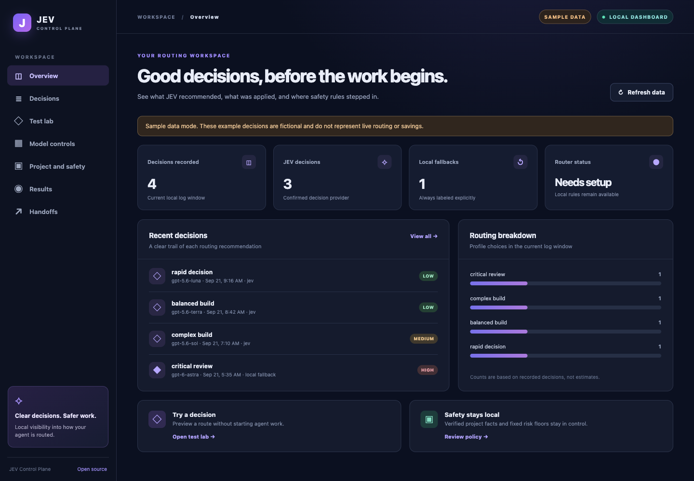
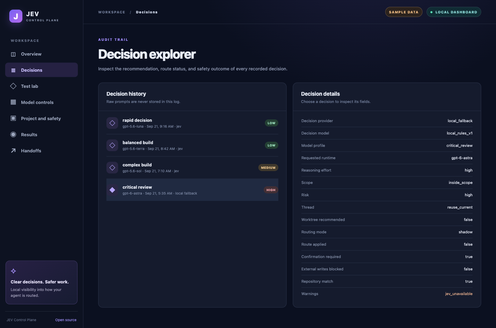
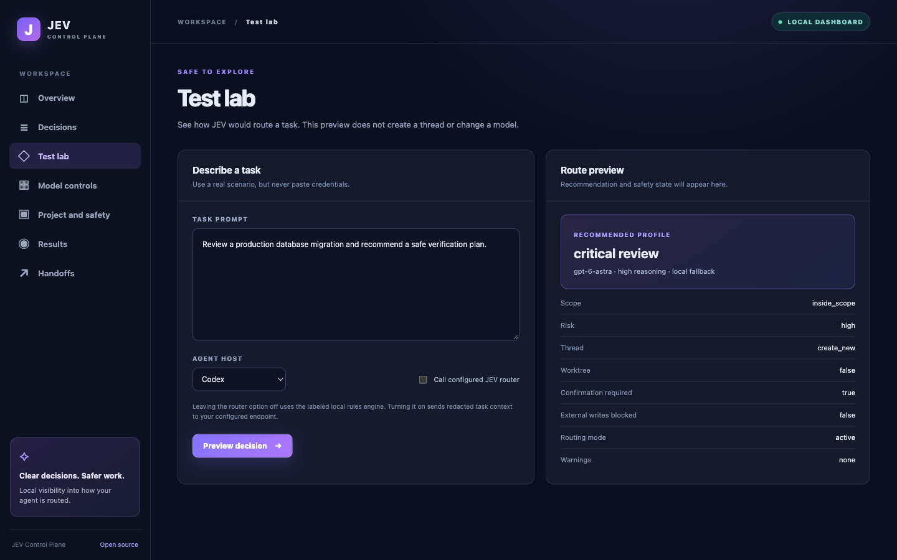
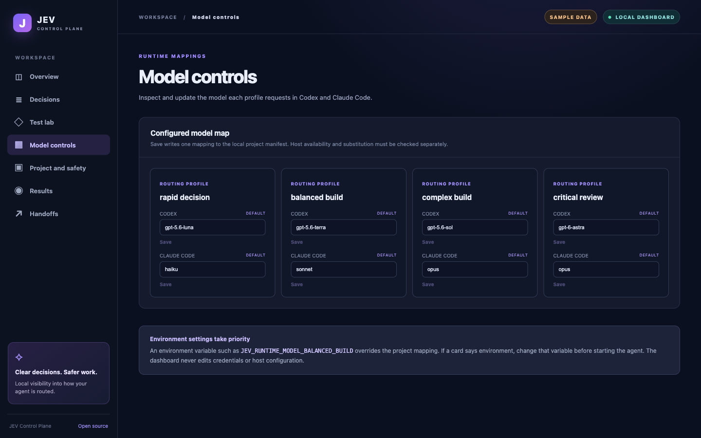
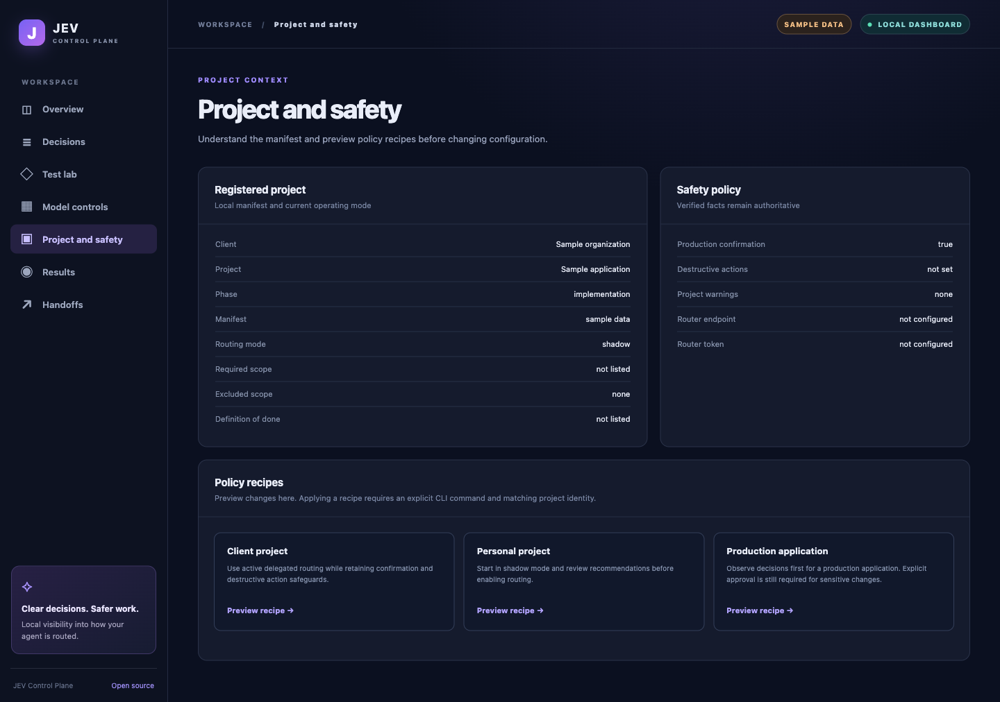

# Local dashboard

JEV Control Plane includes a local dashboard for inspecting decisions and trying routing scenarios. It binds to `127.0.0.1` only. No dashboard account, cloud database, or new Python package is required.

Start it from a project with a `.jev/project.json` manifest:

```bash
python3 plugins/jev-control-plane/scripts/jev_control_plane.py dashboard \
  --cwd /path/to/project \
  --data-dir /path/to/plugin/data
```

Open the printed local address in a browser. The default port is `8765`. Use `--port` to choose another port. If the plugin data directory is not known yet, omit `--data-dir`. The dashboard will still show the project and test lab, but decision history may be empty.

To explore the interface without real project data:

```bash
python3 plugins/jev-control-plane/scripts/jev_control_plane.py dashboard --demo
```

Demo mode is clearly marked and uses fictional sample decisions. The test lab and handoff export are disabled in that mode.

## What each section does

1. **Overview** shows connection readiness, recorded decisions, fallback count, and recent routes.
2. **Decision explorer** shows provider, profile, requested runtime, scope, risk, worktree advice, confirmation, and write block status. Raw prompts are not stored.
3. **Test lab** previews a decision without creating a thread or changing a model. Local rules are the default. The optional JEV checkbox sends redacted task context to your configured router.
4. **Model controls** shows current Codex and Claude Code model mappings and can save one mapping at a time to the local project manifest after confirmation. Environment variables take precedence over saved project mappings.
5. **Project and safety** displays manifest context and previews policy recipes. Apply a recipe only through the explicit CLI command with a matching project ID.
6. **Results** reports actual local counts. It does not estimate token or money savings or claim that a requested model actually ran.
7. **Handoffs** exports a sanitized context packet. The packet has a checksum for accidental changes but is not authenticated and does not authorize external work.

## Screenshots

These captures are from the real local dashboard. The overview, decision explorer, and project view use clearly marked fictional sample data. The test lab capture shows a local rules preview in a registered project. It did not call the JEV router or execute the task.











## Security boundaries

The server listens on loopback only and rejects nonlocal Host headers. API responses expose a small allowlist of decision metadata. Browser controls can update project model mappings, but cannot apply policy recipes or change host settings or credentials. Keep plugin logs and project manifests private to your machine. A requested model is not proof that the host actually ran it.

The `external_writes_blocked` and confirmation fields are routing decisions. They are not a universal tool interception mechanism. Agents and hosts must honor them before external actions.
